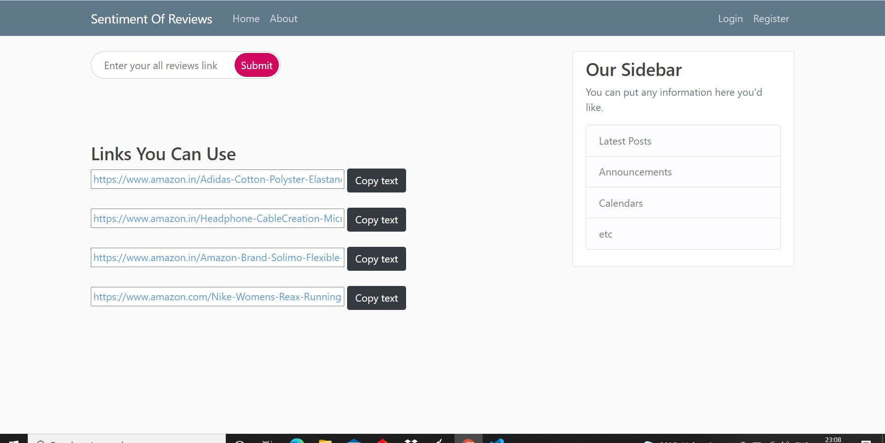
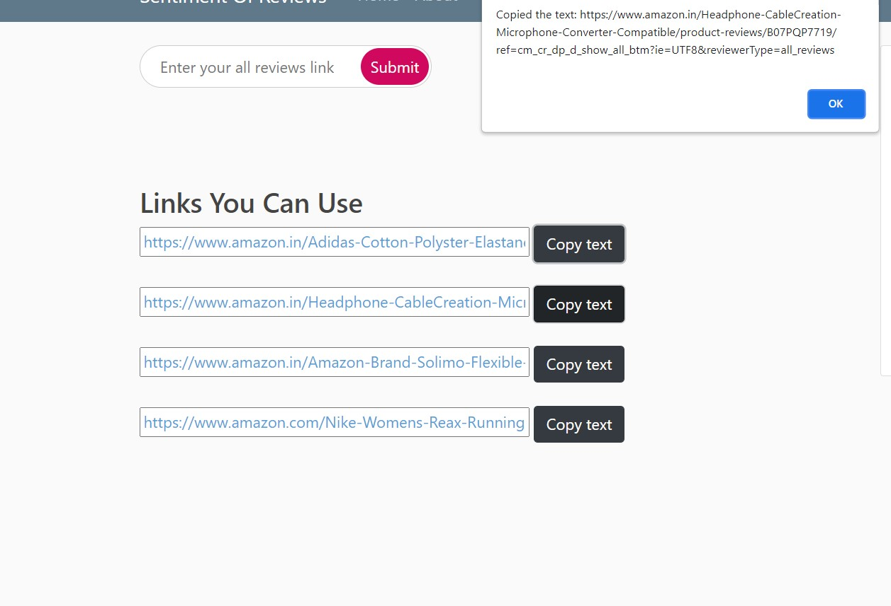
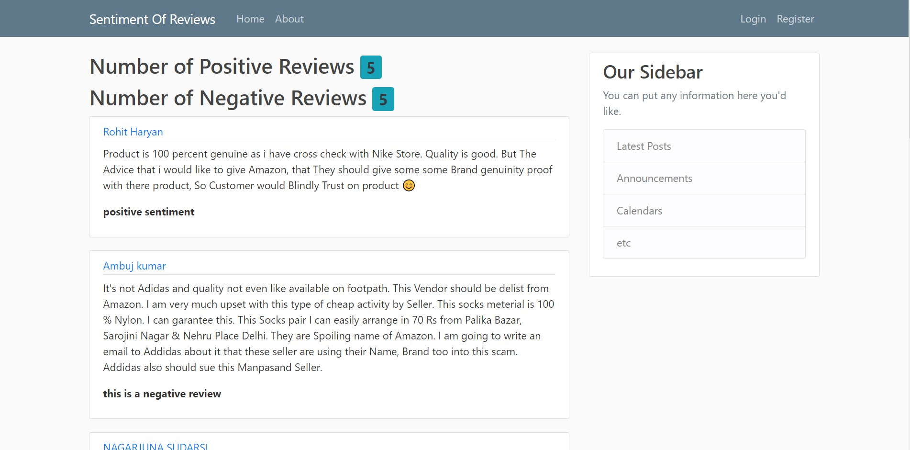
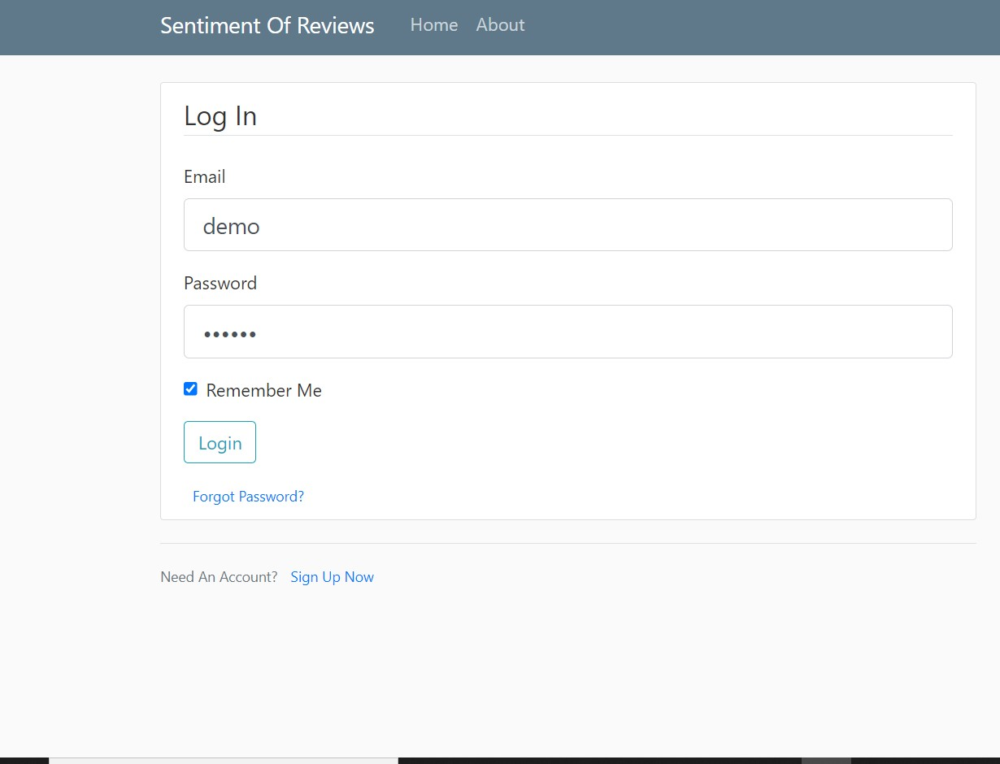

# Sentiment Of Reviews

This is a web applictaion build using Flask,html,css,javascript.
We all purhcase products from amazon but we all want quickly to get the 
Idea of reviews by consumers.This app will defintely Help you.Excited?

## Acknowledgements

 - [Train.txt dataset](https://www.kaggle.com/praveengovi/emotions-dataset-for-nlp)
 
  ## Color Reference

| Technologies Used                                                                   |
| ----------------- | 
| NLP      | 
| RandomForestClassifier | 
| html,css,js |

## Development strategies used

- Webscrapping
- Model tuning for RandomRorestClassifier
- Natural Language Processing: stopwords,lemmatization,wordcloud,etc

## Demo

## Feedback

If you have any feedback, please reach out to me at rajhmourya@gmail.com

Thank You!